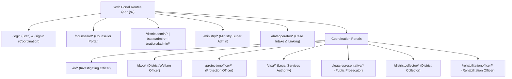
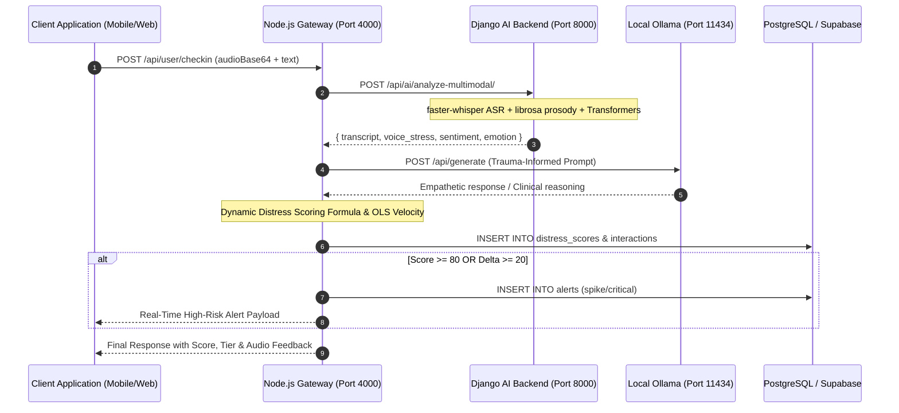

# Mansakha Codebase Architecture & Technical File Analysis

> **Comprehensive Source-Code & File System Analysis of the `Mansakha/` Project**  
> *Generated via direct analysis of application code, schemas, components, and inference microservices.*

---

## 1. Executive Codebase Overview

The `Mansakha/` workspace is organized into four independent application runtimes and one asset/weights repository, implementing a complete sovereign mental health, distress prediction, and statutory coordination platform:

```
Mansakha/
├── backend/                  # Node.js + Express.js central API gateway & Supabase database layer
├── frontend/                 # React Native (Expo) mobile client for beneficiaries & mobile responders
├── web-frontend/             # React (Vite) administration, clinical & multi-agency web portal
├── AI-backend/               # Django REST microservice for local ML inference & audio processing
└── Mansakha-Ai/              # Trained PyTorch/Scikit-learn model weights, feature extractors & datasets
```

### Technology Matrix Across Subsystems

| Runtime / Directory | Core Framework | Primary Languages | Key Packages & Libraries | Execution Role |
| :--- | :--- | :--- | :--- | :--- |
| **`backend/`** | Node.js / Express 4 | JavaScript (CommonJS), SQL | `@supabase/supabase-js`, `pg`, `bcrypt`, `jsonwebtoken`, `express-rate-limit`, `puppeteer`, `twilio` | Central business logic, auth/RBAC, database queries, background workers, WebSocket dispatch. |
| **`frontend/`** | React Native 0.81, Expo 54 | JavaScript (ESM / JSX) | `three`, `expo-gl`, `expo-audio`, `expo-speech`, `expo-location`, `@react-navigation/*`, `@tanstack/react-query` | Mobile app: 24/7 AI chat, 3D avatar WebGL rendering, holographic voice visualizer, wellness tools, SOS. |
| **`web-frontend/`** | React 19, Vite 8 | JavaScript (ESM / JSX), CSS | `react-router-dom`, `lucide-react`, `tailwindcss`, `sonner` | Web portal: 14 distinct roles (Counsellors, Admins, IO, DWO, DLSA, Protection Officer, Collectors). |
| **`AI-backend/`** | Django 5, Django REST | Python 3.10+ | `torch`, `transformers`, `faster-whisper`, `librosa`, `scikit-learn`, `requests` | Dedicated ML inference: ASR speech transcription, acoustic prosody stress analysis, NLP transformers. |
| **`Mansakha-Ai/`** | Scikit-learn, HuggingFace | Python, Pickle (`.pkl`) | `numpy`, `scipy`, `pandas`, `soundfile`, `transformers` | Model weights repository (`pitch_emotion_model_v2.pkl`, `PS094_Sentiment_Model`, `MultilingualEmotion`). |

---

## 2. API Gateway & Business Logic (`backend/`)

### 2.1 Process Lifecycle & Server Orchestration (`backend/server.js`)
- **Port**: Listens on `process.env.PORT || 4000` (`0.0.0.0`).
- **Resilience & Process Guard**: Implements process-level listeners (`process.on('unhandledRejection')` and `process.on('uncaughtException')`) to prevent unhandled asynchronous Supabase query rejections from crashing the HTTP server.
- **Middleware Chain**:
  - `cors`: Configured with dynamic origin whitelist from `process.env.CORS_ORIGINS`.
  - `express.json()`: JSON body parsing.
  - Global response envelopes (`ok()`, `fail()`) via `src/core/services/responseEnvelope.js`.
- **Background Daemon Workers**:
  - `startDispatchWorker()`: Dispatches real-time alerts, SMS/IVRS triggers, and scans for 7-day beneficiary inactivity disengagement.
  - `startAgencyEscalationChecker()`: Monitors statutory timelines across agency referrals and escalates overdue tasks to District Collectors.
  - `startECourtSyncWorker()`: Synchronizes case judicial progress with external eCourts case stages.

### 2.2 Domain Route Modules (`backend/src/`)
The routing layer is segregated into 18 domain-specific subdirectories under `backend/src/`:

1. **`core/`**:
   - `src/core/routes/auth.staff.routes.js`: Pre-role shared login endpoint for Counsellor, District Admin, State Admin, National Admin, and Data Operator.
   - `src/core/routes/auth.signin.routes.js`: Shared sign-in endpoint for the 7 coordination and statutory agency roles.
   - `src/core/middleware/requireAuth.js` & `requireRole.js`: JWT token verification and granular role permission enforcement.
   - `src/core/middleware/requireInternalSecret.js`: Shared secret verification guarding server-to-server AI endpoints.
2. **`user/`** (`src/user/routes/`):
   - Authentication via phone/password or Google OAuth (`auth.user.routes.js`).
   - Profile management, check-in history, journal storage, threat reporting, and statutory intervention submission (`user.routes.js`).
3. **`counsellor/`** (`src/counsellor/routes/counsellor.routes.js`):
   - Assigned case roster, patient check-in reviews, multi-signal breakdown inspection, AI-assisted case note authoring, and direct messaging.
4. **`district_admin/`**, **`state_admin/`**, **`national_admin/`**, **`ministry/`**:
   - Jurisdictional dashboards, staff provisioning, counsellor reassignment, emergency alert management, audit logs, and aggregated metric reporting.
5. **`ai/`** (`src/ai/`):
   - `src/ai/routes/ai.routes.js`: Exposes `/api/ai/analyze-interaction` and `/api/ai/ivrs-call-result`.
   - `src/ai/ai.js`: High-level AI coordination combining acoustic, sentiment, emotion, and Ollama reasoning.
   - `src/ai/djangoAiClient.js`: HTTP client communicating with Django microservice on port 8000.
   - `src/ai/ollama.js`: Direct HTTP client communicating with local Ollama daemon on port 11434 (`gemma3:4b`).
   - `src/ai/scoring.js`: Mathematical calculation of the Dynamic Distress Score ($0-100$) and OLS linear trend risk velocity.
6. **Statutory & Inter-Agency Coordination Modules**:
   - `src/io/routes/io.routes.js`: Investigating Officer station-scoped case queue and investigation records.
   - `src/dwo/routes/dwo.routes.js`: District Welfare Officer relief and DBT compensation tracking.
   - `src/protection_officer/routes/protectionOfficer.routes.js`: Physical protection orders, threat response registries.
   - `src/dlsa/routes/dlsa.routes.js`: District Legal Services Authority free legal aid queue and advocate allocation.
   - `src/legal_representative/routes/legalRepresentative.routes.js`: Assigned advocate case details, trial hearings, and legal filings.
   - `src/district_collector/routes/districtCollector.routes.js`: High-level inter-agency committee oversight and overdue task reviews.
   - `src/rehabilitation_officer/routes/rehabilitationOfficer.routes.js`: Psychosocial rehabilitation plans, vocational training, and housing aid.
   - `src/dataoperator/routes/dataoperator.routes.js`: Data intake, FIR verification, and eCourts linking.
   - `src/mail/routes/mail.routes.js`: Internal staff mail communications (`Mansakha Mail`) across all official tiers.

### 2.3 Database Architecture & SQL Migrations (`backend/src/core/db/`)
- **Base Schema (`schema.sql`)**: 58 KB relational schema containing 19 core tables with primary/foreign keys, indices, and constraints:
  - `jurisdictions`: Hierarchical national, state, and district geographic entities.
  - `roles` & `staff_profiles`: Role-based access definitions and credential storage.
  - `users`: Beneficiary accounts (anonymous tokens, phone numbers, credentials).
  - `cases`: Core atrocity incident records, FIR numbers, court identifiers, and assigned staff.
  - `distress_scores`: Longitudinal timeseries recording numerical scores, risk tiers, and individual signal contributions.
  - `interactions`: Chat, voice note, check-in, and call records.
  - `alerts`: Event-driven high-priority distress spike ($\Delta \ge 20$) and Critical score ($\ge 80$) notifications.
  - `interventions`: Specific statutory relief requests (Protection, Medical, Relocation, Legal).
  - `threat_reports`: Incident witness intimidation and accused harassment filings.
  - `agency_referrals` & `agency_tasks`: Task distribution across IO, DWO, DLSA, and Protection Officers.
  - `mansakha_mail`: Secure internal inter-staff messaging threads.
- **Progressive Migrations**: 46 SQL migrations (`migration_002` through `migration_046`) documenting schema changes such as case linking, eCourts stages, legal aid consolidation, and coordinate tracking.
- **Connection Handlers**:
  - `pgPool.js`: Native `pg` connection pool for direct transactional SQL queries.
  - `supabaseClient.js`: Supabase JavaScript client for role-level and storage operations.

---

## 3. Mobile Frontend Application (`frontend/`)

### 3.1 Architecture & Runtime Configuration
- **Framework**: React Native 0.81.5 running on Expo SDK 54 with Metro bundler.
- **Entry Point**: `frontend/App.js` initializes font assets (`PublicSans`), safe area providers, React Query caching (`@tanstack/react-query`), and root navigation.
- **Navigation Topology (`src/user/navigation/RootNavigator.js`)**:
  - Unauthenticated Stack: Login, Phone OTP, Google OAuth, Onboarding flow.
  - Authenticated Stack: Main Bottom Tabs (`Home`, `Chatbot`, `Journal`, `Support`, `Profile`), plus modal overlays for full-screen voice/video calls, emergency SOS, and legal aid hubs.

### 3.2 3D Computer Graphics & Interactive Avatar Subsystem
- **3D Controller (`src/user/chat/components/Avatar3DController.js`)**:
  - Renders inside an `expo-gl` / Three.js WebGL canvas.
  - Loads ReadyPlayerMe GLB models: `public/models/casual_male.glb` (male counsellor in blue polo shirt) and `readyplayer.glb` (female counsellor).
  - Procedural Kinematics:
    - Captures skeletal bones (`Head`, `Neck`, `LeftEye`, `RightEye`).
    - Modulates pitch, yaw, and roll based on conversation context: generates $5^\circ$ lateral head tilts ($Z = +0.055\text{ rad}$) and affirmative nods ($0.4\text{ Hz}$) when empathy triggers are active.
    - Simulates physiological breathing sway ($0.28\text{ Hz}$) and random saccadic blinking.
    - Synchronizes speech boundaries with facial viseme morph targets (`viseme_aa`, `mouthOpen`, `viseme_O`, `viseme_U`).
- **Holographic Call Visualizer (`src/user/chat/components/MansakhaCallModal.js`)**:
  - Provides a fullscreen WhatsApp-style call overlay with dual audio/video toggle modes.
  - Audio Call Mode: Renders a 1:1 circular HTML5/Canvas 3D gyroscope hologram containing 160 depth-sorted points, 3 rotating orbital planetary rings, ambient radial aura, and an animated 28-bar audio frequency equalizer.
  - Video Call Mode: Swaps canvas to full-frame 3D WebGL avatar with real-time lip-sync and active camera feedback.

### 3.3 Core User Screens (`src/user/`)
- **`chat/screens/ChatScreen.js`**: 24/7 empathetic chat companion with voice-note recording, audio playback, speech-to-text input, and dynamic typing states.
- **`chat/screens/CounsellorChatScreen.js`**: End-to-end human counsellor communication channel.
- **`wellness/screens/HomeScreen.js`**: Primary dashboard displaying the dynamic distress gauge, current risk level badge, assigned counsellor card, and wellness nudges.
- **`wellness/screens/CheckinScreen.js`**: Multi-turn adaptive wellness questionnaire with dynamic questions generated via Ollama.
- **`wellness/screens/DistressHistoryScreen.js`**: 14-day chronological distress timeseries bar chart.
- **`wellness/screens/JournalScreen.js` & `MyEntry.js`**: Private speech-to-text reflective journal tracking response length.
- **`wellness/screens/ThreatReportScreen.js` & `RequestInterventionScreen.js`**: Statutory relief filing interfaces.
- **`wellness/screens/CaseDetailsScreen.js`**: Status tracker for FIR investigation and eCourts judicial stages.
- **`wellness/screens/CompensationScreen.js` & `FinancialAidScreen.js`**: DBT relief tracking under MoSJE schemes.
- **`shared/components/AiChatButton.js`**: Floating Action Button (FAB) that dynamically listens to React Navigation state to hide itself inside `/MainTabs/Chatbot`.
- **`shared/components/GetHelpButton.js`**: Dedicated emergency SOS button triggering direct phone calls to PCR 100 / 14566.

---

## 4. Administrative & Multi-Agency Web Portal (`web-frontend/`)

### 4.1 Architecture & Build Setup
- **Framework**: Vite 8 with React 19 and Tailwind CSS 3.4.
- **Entry Point**: `src/index.jsx` rendering `src/App.jsx` with HTML5 `BrowserRouter` and toast context providers (`sonner`).

### 4.2 Multi-Role Portal Hierarchy (`src/App.jsx`)
`App.jsx` defines 14 separate jurisdictional and statutory role interfaces:



### 4.3 Key Administrative & Clinical Interfaces
1. **Counsellor Portal (`src/counsellor/`)**:
   - `CaseDetail.jsx`: Multi-signal explainable triage decomposing distress into Sentiment, Voice Stress, Emotion, and Engagement Delta.
   - Displays predictive regression trajectory warnings (distress velocity in $\text{pts/day}$ and days to Critical threshold).
   - `CaseNotes.jsx`: Allows clinical review, editing, and signing of AI-drafted case notes.
   - `AlertsFeed.jsx`: Real-time queue of distress spikes ($\Delta \ge 20$) and critical risk flags.
2. **District Admin Portal (`src/district_admin/`)**:
   - Caseload distribution, case assignment to psychologists, statutory referral routing, and emergency alert escalation.
3. **State Admin Portal (`src/state_admin/`)**:
   - Cross-district heatmaps, aggregate distress trajectory analysis, and inter-district resource balancing.
4. **Ministry Portal (`src/ministry/`)**:
   - National staff management, counsellor performance audits, global audit log inspection, and statutory reporting.
5. **Coordination Agency Portals**:
   - `io/pages/CaseQueue.jsx`: Police station-scoped investigation logs.
   - `dwo/pages/ReferralCompensation.jsx`: Victim financial compensation tracking.
   - `protection_officer/pages/ProtectionRegistry.jsx`: Physical protection and safe house deployment.
   - `dlsa/pages/LegalAidQueue.jsx`: Advocate appointment and court hearing scheduling.
   - `district_collector/pages/CommitteeReview.jsx`: Inter-agency committee review meetings and overdue task escalations.

---

## 5. Machine Learning & Speech Inference Engine (`AI-backend/`)

### 5.1 Architecture & Services (`AI-backend/api/`)
The Django REST microservice (`AI-backend/`) acts as the dedicated ML processing node:

- **`api/views.py`**:
  - `HealthCheckView` (`GET /api/ai/health/`): Verifies the presence of local model files and queries Ollama connectivity (`GET /api/tags`).
  - `AnalyzeTextView` (`POST /api/ai/analyze-text/`): Processes text through sentiment and emotion models.
  - `TranscribeAudioView` (`POST /api/ai/transcribe/`): Decodes voice audio into text using faster-whisper.
  - `AnalyzeVoiceStressView` (`POST /api/ai/analyze-voice-stress/`): Extracts acoustic features and calculates voice stress.
  - `AnalyzeMultimodalView` (`POST /api/ai/analyze-multimodal/`): Executes joint audio transcription, prosody scoring, and text emotion extraction in a single request.
  - Ollama Proxy Endpoints: Chat completions, dynamic check-in question generation, clinical rationales, and case note summarization.
- **`api/ai_services.py`**:
  - Contains core inference functions wrapping HuggingFace Transformers, faster-whisper, and Scikit-learn models.

### 5.2 Signal Extraction Implementations
1. **Speech-to-Text Transcription (`transcribe_audio`)**:
   - Uses `faster-whisper` running on CTranslate2.
   - Audio preprocessing converts incoming audio (base64 or multipart) to 16kHz mono WAV via `tempfile`.
   - Secondary integration with IIT Madras Speech Lab ASR API for localized Indian-accented speech recognition.
2. **Acoustic Voice Stress Analysis (`analyze_voice_stress`)**:
   - Reads audio signal using `librosa`.
   - Extracts pitch fundamental frequency ($F_0$) via probabilistic YIN (pYIN), jitter, shimmer, spectral centroid, spectral bandwidth, and RMS energy.
   - Normalizes feature vector using `pitch_scaler_v2.pkl`.
   - Evaluates features via `pitch_emotion_model_v2.pkl` (VotingClassifier ensemble) to output a continuous Voice Stress Score ($0.0 - 1.0$).
3. **Trauma Sentiment Analysis (`analyze_sentiment`)**:
   - Loads `Mansakha-Ai/PS094_Sentiment_Model` (fine-tuned transformer).
   - Produces continuous sentiment polarity score ($-1.0$ to $+1.0$).
4. **Multilingual Emotion Analysis (`analyze_emotion`)**:
   - Loads `Mansakha-Ai/MultilingualEmotion` (XLM-RoBERTa architecture).
   - Classifies text across 11 discrete emotion categories (fear, sadness, anger, joy, optimism, etc.).
   - Weights negative trauma emotions into a normalized Emotion Distress Score ($0.0 - 1.0$).

---

## 6. Pretrained Models & Training Pipeline (`Mansakha-Ai/`)

The `Mansakha-Ai/` directory houses model checkpoints, scalers, and training datasets:

```
Mansakha-Ai/
├── VoicePitchData/
│   ├── pitch_emotion_model_v2.pkl   # VotingClassifier ensemble (929 MB)
│   ├── pitch_scaler_v2.pkl          # Feature normalization scaler
│   ├── pitch_label_encoder_v2.pkl   # Label encoder
│   ├── pitch_features.py            # Feature extraction script
│   ├── train_v2.py / train_v3.py    # Model training scripts
│   └── Voice Emotion Dataset/       # Audio training samples
├── hf/
│   ├── PS094_Sentiment_Model/       # Fine-tuned trauma sentiment transformer
│   ├── MultilingualEmotion/         # XLM-RoBERTa 11-class emotion model
│   ├── IndicBERTv2/                 # Indic language transformer
│   ├── IndicSentiment/              # Indic sentiment model
│   └── VideoEmotion/                # Facial emotion detection scripts (ve3.py, video_emotio2.py)
└── voice to text/
    ├── indic_transcribe.py          # Standalone Whisper transcription script
    └── downloader.py                # Model weight downloader utility
```

---

## 7. Inter-Process Communication & Data Flow



---

## 8. Verification & Test Assets

The codebase includes automated test suites and validation scripts across layers:

1. **Backend Unit Tests**:
   - `backend/src/ai/scoring.test.js`: Validates Phase 1 (text-only) and Phase 2 (multimodal) distress score calculations, threshold tier mappings (Low, Moderate, High, Critical), and OLS linear trend regression velocity.
   - `backend/test.js` & `backend/test2.js`: Validates database pool connections and legal aid assignment flows.
2. **Frontend End-to-End Tests**:
   - `frontend/playwright.config.js`: Configuration for Playwright automated UI testing.
   - `frontend/tests/`: End-to-end integration tests for user authentication and navigation.
3. **AI Backend Smoke Checks**:
   - `AI-backend/check_iitm.py`: Verifies IIT Madras Speech Lab API connectivity.
   - `Mansakha-Ai/hf/test_video_emotion.py`: Tests video-based facial emotion detection pipelines.
