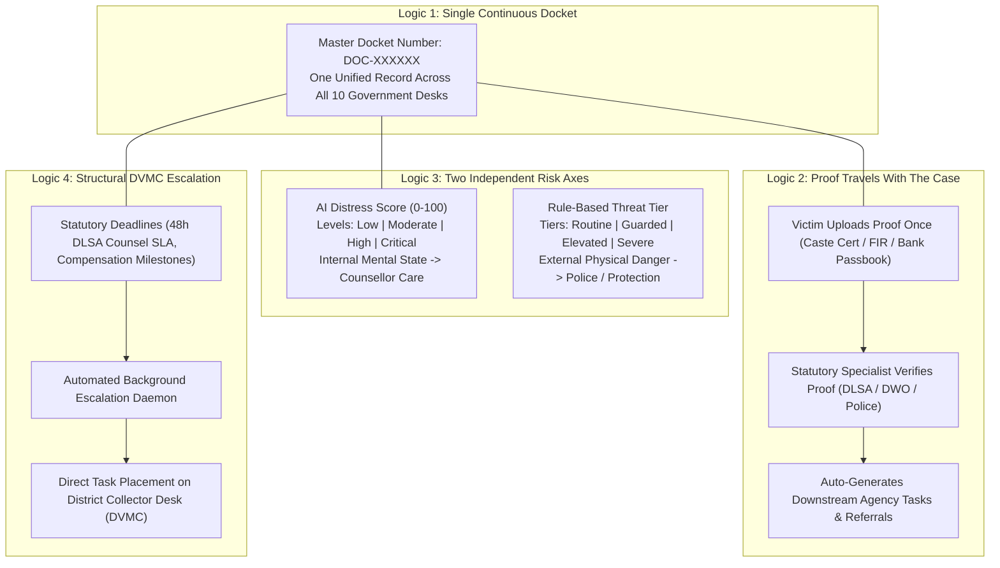
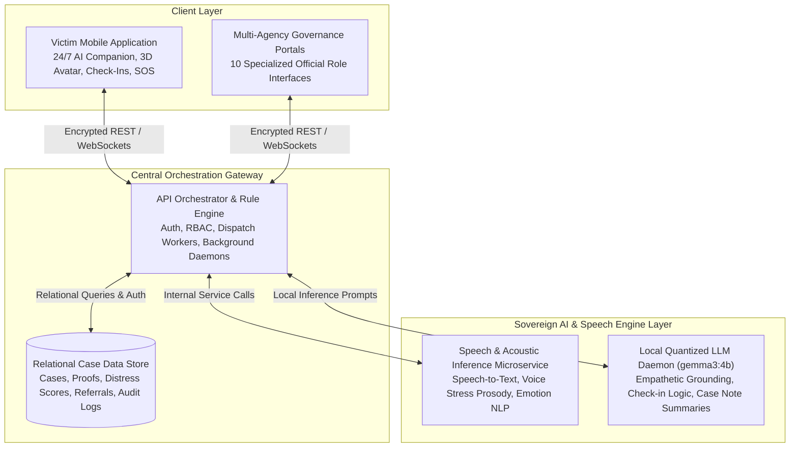
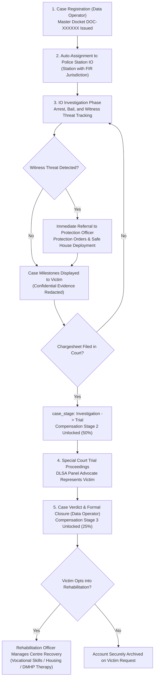
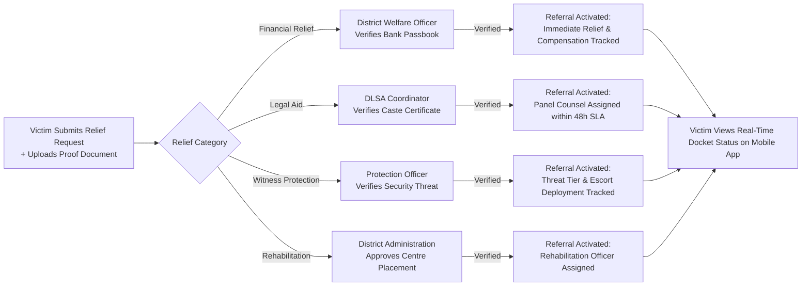
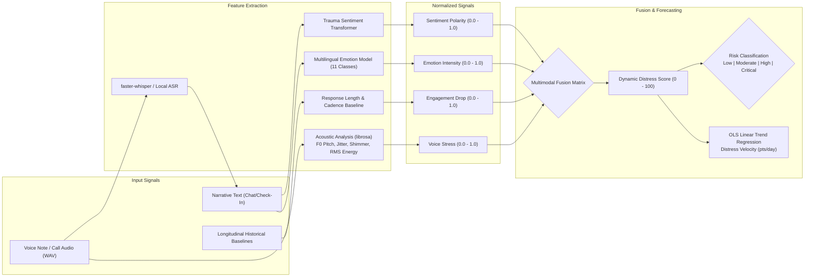
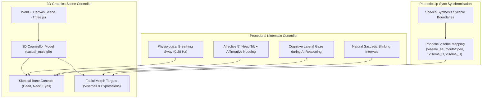

# Mansakha (मानसखा) — SIH26094
### *Mind Matters — We Are Listening*

> **Dual-Interface Digital Ecosystem for SC/ST (Prevention of Atrocities) Act Victim Support & Multi-Agency Case Coordination**  
> *Developed for the Ministry of Social Justice and Empowerment (MoSJE), Government of India*  
> *Grounded in the SC/ST (PoA) Act 1989, Dr. Ambedkar National Relief Scheme, NALSA Legal-Aid Entitlements & DPDP Act 2023*

---

## 1. Problem Statement Mapping & Systemic Vision (PS 094)

Under the **Scheduled Castes and the Scheduled Tribes (Prevention of Atrocities) Act, 1989 (PoA Act)**, an atrocity survivor must navigate a complex, fragmented network of separate government departments:
1. **The Police Station**: Registers the First Information Report (FIR) and conducts the investigation.
2. **The District Welfare Officer (DWO)**: Verifies social welfare documentation and sanctions statutory financial relief.
3. **The District Legal Services Authority (DLSA)**: Mandated under NALSA guidelines to assign free legal counsel.
4. **The Protection Officer & Police Unit**: Evaluates physical security threats, witness intimidation, and safe-house needs.
5. **The District Collector’s Vigilance & Monitoring Committee (DVMC)**: Statutory committee mandated by law to review case pendency and welfare delivery.
6. **Rehabilitation Centres & District Mental Health Programme (DMHP)**: Manages post-trial recovery, vocational training, and long-term psychosocial care.

```
       ┌─────────────────────────────────────────────────────────────────┐
       │               THE CURRENT SYSTEMIC BREAKDOWN                    │
       ├────────────────────────────────┬────────────────────────────────┤
       │ 1. Repeated Trauma Narration   │ Victim re-narrates incident at │
       │                                │ every separate official desk.  │
       ├────────────────────────────────┼────────────────────────────────┤
       │ 2. Disconnected Mental Health  │ Psychological care is entirely │
       │                                │ isolated from legal processes. │
       ├────────────────────────────────┼────────────────────────────────┤
       │ 3. Opaque Financial Relief     │ No tracking for multi-stage    │
       │                                │ statutory compensation disbursal│
       ├────────────────────────────────┼────────────────────────────────┤
       │ 4. Unactioned Threats          │ Intimidation raised at welfare │
       │                                │ never reaches the police unit. │
       ├────────────────────────────────┼────────────────────────────────┤
       │ 5. Passive Committee Oversight │ DVMC reviews paper registers   │
       │                                │ long after legal deadlines lapse│
       └────────────────────────────────┴────────────────────────────────┘
```

### The Mansakha Solution Plan
**Mansakha (मानसखा — *"Mind Matters — We Are Listening"*)** resolves PS 094 by replacing disconnected physical paper trails with a synchronized dual-interface ecosystem:
- **For the Beneficiary / Survivor**: A single, continuous mobile companion providing 24/7 empathetic conversational grounding, proactive distress monitoring, a real-time 3-stage compensation tracker, and one-tap emergency SOS dispatch.
- **For Government Stakeholders**: Ten role-scoped web portals connected to a single continuous case docket (`DOC-XXXXXX`). Every agency works from its own specialized queue while reading from and writing to a single shared truth.

---

## 2. Core Architectural Innovations & System Logics

The architecture is built upon six foundational structural logics designed to resolve the systemic delays and institutional trauma of atrocity case management:



### 1. The Single Continuous Case Docket (`DOC-XXXXXX`)
Instead of each department maintaining an independent physical file, every registered incident is assigned a permanent master docket identifier (`DOC-XXXXXX`). This record persists across the survivor's entire journey—from initial police intake and welfare sanctioning through court trial and post-verdict rehabilitation.

### 2. "Proof Travels with the Case" (Single-Verification Pipeline)
Victims upload essential documentation (caste certificate, FIR copy, bank passbook) **only once** through the mobile interface. Verification is performed exclusively by the statutory specialist legally designated for that proof:
- **Caste Certificate**: Verified by the **DLSA Coordinator** to unlock free legal counsel.
- **Bank Passbook**: Verified by the **District Welfare Officer** to unlock Direct Benefit Transfer (DBT) relief.
- **FIR Copy**: Verified by the **Investigating Officer** to confirm police registration.

Once verified, downstream agency referrals and payment milestones unlock automatically—eliminating repeated physical paperwork.

### 3. Two Axes of Risk, Kept Strictly Independent
To prevent clinical trauma from being confused with physical witness intimidation, the system computes two completely independent risk metrics with mutually exclusive vocabularies:

- **Axis A: AI-Derived Distress Score ($0-100$) — Mental Health State**:
  - Risk Levels: **Low** ($0-29$), **Moderate** ($30-59$), **High** ($60-79$), **Critical** ($80-100$).
  - Evaluates internal psychological trauma, depression, voice stress, and affective distress from check-ins, chats, voice notes, and IVRS calls.
  - Directly drives the **Counsellor** therapeutic care queue.
- **Axis B: Rule-Based Threat Tier — Physical Security & Danger**:
  - Threat Tiers: **Routine**, **Guarded**, **Elevated**, **Severe**.
  - Evaluates external physical safety, accused bail status, and witness intimidation through deterministic, auditable statutory rules:
    - **Severe**: Accused is *Absconding* OR survivor has triggered $\ge 2$ SOS emergency events in the past 7 days.
    - **Elevated**: Accused is *Out on Bail* in a case marked *Witness Facing Intimidation or Threats* OR survivor has triggered $\ge 1$ SOS events in the past 7 days.
    - **Guarded**: Accused is *Out on Bail* (standard atrocity charge).
    - **Routine**: Accused is confirmed *In Custody* or *Convicted*.
    - *Not Yet Assessed*: Initial state before IO status entry and SOS logs.
  - Directly drives the **Protection Officer** and **Police** physical security queue.

### 4. Structural Escalation to the District Collector (DVMC Oversight)
Statutory compliance is enforced algorithmically. An automated escalation daemon continuously scans all active cases against statutory timelines:
- If DLSA fails to assign panel counsel within the mandatory **48-hour SLA**,
- If chargesheet status is not updated within statutory periods, or
- If approved compensation stages remain undisbursed,  
the task automatically elevates onto the **District Collector’s** dashboard, operationalizing the statutory oversight mandate of the District Vigilance & Monitoring Committee (DVMC).

### 5. Transparent 3-Stage Statutory Compensation Tracker
Grounded directly in the **Dr. Ambedkar National Relief Scheme** and the PoA Act statutory compensation schedules, the victim interface displays an auditable 3-stage visual progress tracker:
- **Stage 1 (Immediate Relief / 25%)**: Disbursed upon FIR registration and initial welfare verification.
- **Stage 2 (Investigation Complete / 50%)**: Disbursed when the Investigating Officer files the chargesheet in the Special Court.
- **Stage 3 (Trial Conclusion / 25%)**: Disbursed upon trial verdict or final judicial pronouncement.

### 6. One-Tap Emergency Multi-Agency Fan-Out
Activating the emergency SOS trigger executes a coordinated parallel protocol:
1. Opens the native device dialler directly to the **Police Control Room (PCR 100)** or **Atrocity Helpline (14566)**.
2. Captures GPS coordinates (best-effort, with explicit user permission).
3. Simultaneously broadcasts real-time high-priority alerts to the **Assigned Counsellor**, **District Administration**, **State Administration**, and **Protection Officer**.

### 7. Telephonic IVRS Outreach & Automated Disengagement Logic
To ensure universal accessibility for rural, illiterate, or non-smartphone populations, the platform integrates automated Interactive Voice Response System (IVRS) telephony:
- **Automated Outbound Calling**: Outbound check-in calls are dispatched in the survivor's regional language via telecom gateways connected to the National Atrocity Prevention Helpline (14566).
- **The 5-Second Disengagement Protocol**:
  - If an IVRS check-in call is **unanswered**, OR
  - If the survivor answers but disconnects within **$< 5$ seconds**,  
    the system algorithmically flags this as potential disengagement, silent distress, or active intimidation. It immediately assigns a human counsellor and issues a high-priority follow-up alert.
- **Multimodal Acoustic Scoring on Completed Calls**:
  - When an IVRS call is completed, the voice audio is passed through local ASR and acoustic prosody models.
  - Extracts vocal tension ($F_0$ pitch instability, jitter, shimmer), transcribes text, evaluates trauma sentiment/emotion, and calculates the Dynamic Distress Score asynchronously.
- **Ministry-Level Telephony Audit Log**:
  - All queued, attempted, and completed IVRS calls are logged in a central registry accessible to State and National Ministry officials to monitor rural outreach parity.

---

## 3. System Architecture & Component Roles

The platform is structured into four sovereign tiers, ensuring data privacy and operational autonomy across government infrastructure:



### Functional Tier Breakdown

| System Layer | Architectural Role & Scope | Key Operational Responsibilities |
| :--- | :--- | :--- |
| **Client Experience Layer** | Mobile & Web Interfaces | Native mobile experience for victims (Android/iOS/Web); ten dedicated, role-scoped browser portals for government officials. |
| **Central Orchestration Gateway** | API & Rules Engine | Enforces Role-Based Access Control (RBAC), manages the single case docket lifecycle, executes automated background escalation daemons, and maintains immutable audit logs. |
| **Relational Data Store** | Relational Database | Secure persistence for multi-agency case records, evidence documents (behind time-limited signed URLs), longitudinal distress timeseries, and inter-agency referral logs. |
| **Speech & Acoustic Microservice** | Edge ML Inference | Local execution of Indian-accented speech-to-text transcription, acoustic vocal prosody extraction ($F_0$ pitch, jitter, shimmer), and multilingual trauma emotion classification. |
| **Local LLM Daemon** | Generative Reasoning | Sovereign, on-premises language model generating empathetic conversational therapy turns, adaptive check-in questions, clinical rationales, and objective case notes. |

---

## 4. End-to-End Operational Workflows & Lifecycles

### A. Case Lifecycle: Registration to Post-Closure Rehabilitation



### B. Proof Routing & Downstream Agency Activation



---

## 5. Directory of the 10 Specialized Government Portals

Each official portal is scoped to a single-purpose statutory queue, preventing cognitive overload and ensuring clear accountability:

```
National Super Admin (Ministry of Social Justice and Empowerment)
 └── State Administrator (State Social Welfare & Home Departments)
      └── District Administrator (District Magistrate / Social Welfare Office)
           ├── Assigned Counsellor (Clinical Psychologist / DMHP Specialist)
           ├── Investigating Officer (Police Station / DSP Investigating Unit)
           ├── District Welfare Officer (Disbursing Authority for Compensation)
           ├── DLSA Coordinator (District Legal Services Authority / NALSA)
           ├── Protection Officer (Witness & Victim Protection Cell)
           ├── District Collector (Chair, District Vigilance & Monitoring Committee)
           ├── Rehabilitation Officer (DMHP / Centre-Specific Recovery Staff)
           └── Data Operator (Front-Desk Registration & Formal Case Closure)
```

| Portal Role | Jurisdictional Level | Statutory Function under the Act | Core Responsibilities & Queue Scope |
| :--- | :--- | :--- | :--- |
| **Ministry (MoSJE)** | National | National nodal authority under PoA Act. | Configures nationwide relief rules, provisions official accounts, audits compliance across states, inspects immutable audit logs. |
| **State Administration** | State | State Social Welfare & Home oversight. | Analyzes cross-district distress heatmaps, identifies systemic atrocity spikes, balances inter-district counsellor and protection resources. |
| **District Administration** | District | District Magistrate administrative machinery. | Oversees all district queues, reviews cross-agency bottlenecks, and approves specialized rehabilitation placements. |
| **Data Operator** | Desk / Helpline | Front-desk intake & helpline registration. | Registers incoming cases, issues master docket numbers (`DOC-XXXXXX`), and holds exclusive auditable authority to formally mark cases `Closed`. |
| **Assigned Counsellor** | Clinical | Mental health professional (DMHP / clinical). | 24/7 empathetic chat monitoring, reviews 4-signal explainable distress triage, and reviews/signs AI-drafted clinical case notes. |
| **Investigating Officer (IO)** | Police Station | Investigating Police Officer (DSP rank). | Maintains custody of arrest, bail, and chargesheet facts; alerts Protection Officer on witness intimidation; advances stage to `Trial`. |
| **District Welfare Officer (DWO)** | District | Disbursing authority for statutory relief. | Approves fast Immediate Relief and verifies + disburses 3-stage statutory compensation directly to victim bank accounts. |
| **DLSA Coordinator** | District | District Legal Services Authority (NALSA). | Administers free legal aid gated on caste proof; enforces the **48-hour SLA** for panel counsel assignment; monitors trial hearings. |
| **Protection Officer** | District / Division | Witness and victim protection cell. | Evaluates physical threat tiers, deploys police escorts and safe houses, and coordinates rapid emergency SOS interventions. |
| **District Collector** | District | Chair of District Vigilance & Monitoring Committee (DVMC). | Automatically receives all escalated tasks—missed 48h legal SLAs, stale referrals, unpaid compensation stages—and issues binding directives. |
| **Rehabilitation Officer** | Centre-Specific | Government (DMHP) or NGO rehabilitation centre. | Manages post-verdict long-term recovery plans, skill training, psychosocial rehabilitation, and tracks victim progress until completion. |
| **Legal Representative** | Judicial | DLSA-assigned panel advocate / Special PP. | Accesses legal case files, records court hearing outcomes, and files bail objections on behalf of the victim. |

---

## 6. Multimodal Distress Prediction & Algorithmic Logic

The intelligence engine evaluates psychological trauma across acoustic, linguistic, and behavioral dimensions:



### Mathematical Formulations

#### 1. Multimodal Fusion Matrix (Voice Audio + Text Provided)
When voice notes or calls are recorded, acoustic prosody is mathematically fused with textual sentiment, emotion, and behavioral engagement:

$$\text{Distress Score} = \left( 0.40 \cdot \text{Sentiment}_{\text{raw}} + 0.30 \cdot \text{VoiceStress} + 0.20 \cdot \text{Emotion} + 0.10 \cdot \text{EngagementDrop} \right) \times 100$$

#### 2. Text-Only Fusion Matrix (No Audio Attached)
When communication is text-based only:

$$\text{Distress Score} = \left( 0.50 \cdot \text{Sentiment}_{\text{raw}} + 0.35 \cdot \text{Emotion} + 0.15 \cdot \text{EngagementDrop} \right) \times 100$$

#### 3. Predictive Escalation Trajectory (OLS Linear Regression)
To identify acute psychological deterioration before a crisis occurs, the system evaluates the rate-of-change (velocity) across historical score readings:

$$\text{Velocity } (m) = \frac{N \sum_{i=1}^N (t_i S_i) - \sum_{i=1}^N t_i \sum_{i=1}^N S_i}{N \sum_{i=1}^N t_i^2 - \left(\sum_{i=1}^N t_i\right)^2}$$

$$\text{Estimated Days to Critical Threshold} = \frac{80 - S_{\text{latest}}}{m} \quad (\text{when } m > 0)$$

### Clinical Distress Thresholds vs. Statutory Threat Tiers

To ensure clinical staff and police units never conflate psychological trauma with external physical danger, the system enforces strict separation between both metrics:

| Axis | Metric | Vocabulary Tiers | Primary Signals Evaluated | Responsible Authority & Queue |
| :--- | :--- | :--- | :--- | :--- |
| **Internal Mind** | **Dynamic Distress Score (0–100)** | **Low** ($0-29$)<br>**Moderate** ($30-59$)<br>**High** ($60-79$)<br>**Critical** ($80-100$) | Voice stress ($F_0$, jitter, shimmer), NLP trauma sentiment, multilingual emotion, engagement cadence from mobile check-ins & **IVRS calls**. | **Assigned Counsellor**<br>(Clinical care, therapeutic chat, case notes) |
| **External Safety** | **Rule-Based Threat Tier** | **Routine**<br>**Guarded**<br>**Elevated**<br>**Severe** | Investigating Officer's custody facts (`In Custody`, `Out on Bail`, `Absconding`), witness intimidation case tags, and 7-day SOS event history. | **Protection Officer & Police**<br>(Physical security, safe houses, police escorts) |

---

## 7. Interactive 3D Visual & Affective Companion Logic

The mobile client incorporates real-time hardware-accelerated 3D graphics to provide a humanized, reassuring presence during emotional distress:



### Visual & Interactive Features
- **3D ReadyPlayerMe Male Counsellor**: Professional male model with short hair, trimmed beard, and blue collared polo shirt matching administrative iconography.
- **Natural Bone Kinematics**: Procedural micro-movements simulating physiological breathing ($0.28\text{ Hz}$), random natural blinking intervals, and eye gaze saccades.
- **Affective Emotional States**:
  - **Empathy Mode**: Triggers a gentle $5^\circ$ lateral head tilt ($Z = +0.055\text{ rad}$) and slow affirmative nodding ($0.4\text{ Hz}$) when pain, fear, or trauma keywords are detected.
  - **Thinking Mode**: Slight upward tilt and lateral cognitive glance during AI reasoning turns.
  - **Reassuring Mode**: Direct forward gaze with supportive facial smile morphs.
- **Boundary-Driven Lip-Sync**: Phonetic mouth shapes dynamically synchronized with speech synthesis syllable boundaries.
- **1:1 Holographic Particle Gyroscope**: In voice call mode, renders a distortion-free 3D particle hologram with 160 depth-sorted points, 3 rotating planetary rings, ambient radial aura, and an animated 28-bar audio frequency equalizer.

---

## 8. Relational Data Architecture & Schema Logic

The relational data tier enforces multi-tenant jurisdictional isolation and strict foreign key integrity:


---

## 9. Sovereign Edge Deployment, Privacy & Feasibility Plan

### 1. 100% Sovereign Edge Deployment (Zero External Cloud LLM Costs)
- **Local On-Premises Execution**: All language modeling (`gemma3:4b`), speech-to-text transcription (`faster-whisper`), and prosody extraction execute on local government hardware (e.g., State Data Centres or local edge servers).
- **DPDP Act 2023 Compliance**: Zero victim transcripts, voice recordings, or clinical assessments ever leave Indian territorial jurisdiction or traverse third-party commercial APIs.

### 2. PII Separation & Evidence Security
- **Data Isolation**: Personally Identifiable Information (names, phone numbers, addresses) is stored in isolated tables separated from analytical scoring pipelines.
- **Short-Lived Signed URLs**: Evidence documents (caste certificates, FIR copies, bank passbooks) are held in encrypted object storage accessible solely via short-lived, time-limited signed URLs.
- **Immutable Audit Logging**: Every administrative action, case transition, referral verification, and record access is cryptographically recorded in an immutable audit ledger.

### 3. Rural & Low-Bandwidth Feasibility
- **Low-Bandwidth Mobile Optimization**: The client application is optimized for low-bandwidth 2G/3G mobile networks, using compact JSON payloads and local state caching.
- **SMS / Offline Fallback**: In remote areas lacking continuous mobile data, lightweight SMS-based check-in prompts provide an unobtrusive fallback channel to maintain baseline monitoring.

### 4. Trauma-Informed Clinical Guardrails
- **No Cross-Examination**: The conversational companion is strictly prohibited from interrogating survivors, demanding proof, or questioning incident narratives.
- **Supportive Bridge**: Mansakha never issues psychiatric diagnoses or prescribes medical treatments; it functions as an empathetic first-line support bridge connecting victims to licensed human professionals.

---

## 10. Functional Subsystems & Domain Organization

The platform is organized into five specialized functional subsystems:

```
Mansakha Platform
│
├── 1. Client Experience Subsystem (Mobile & Web)
│   ├── Victim Mobile App (24/7 AI Chat, 3D Avatar Kinematics, Journaling, SOS)
│   └── Multi-Agency Web Portal (10 Role-Scoped Queues & Administrative Dashboards)
│
├── 2. Central Orchestration & Governance Subsystem
│   ├── API Gateway, RBAC Security & Session Token Handlers
│   ├── Multi-Agency Referral Router & Task Dispatch Engine
│   └── Background SLA Escalation Daemon (DVMC District Collector Integration)
│
├── 3. Relational Data & Compliance Subsystem
│   ├── Multi-Tenant Jurisdictional Database Schema
│   ├── Time-Limited Signed Evidence Object Storage
│   └── Cryptographic Audit Ledger & Compliance Logging
│
├── 4. Speech & Acoustic Intelligence Subsystem
│   ├── Indian-Accented Automatic Speech Recognition (ASR)
│   ├── Acoustic Prosody Analysis (F0 Pitch, Jitter, Shimmer, Vocal Tension)
│   └── Multilingual Trauma Emotion & Sentiment Transformers
│
└── 5. Generative Clinical Reasoning Subsystem
    ├── Sovereign On-Premises LLM (Quantized gemma3:4b)
    ├── Trauma-Informed Conversational Therapy Prompts
    └── Automated Clinical Rationale & Case Note Drafting Engine
```
