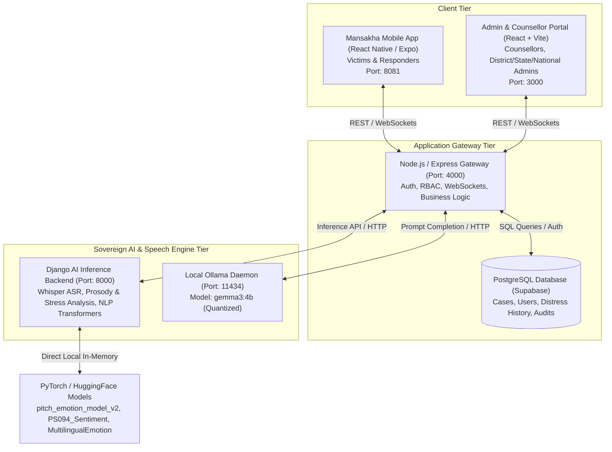
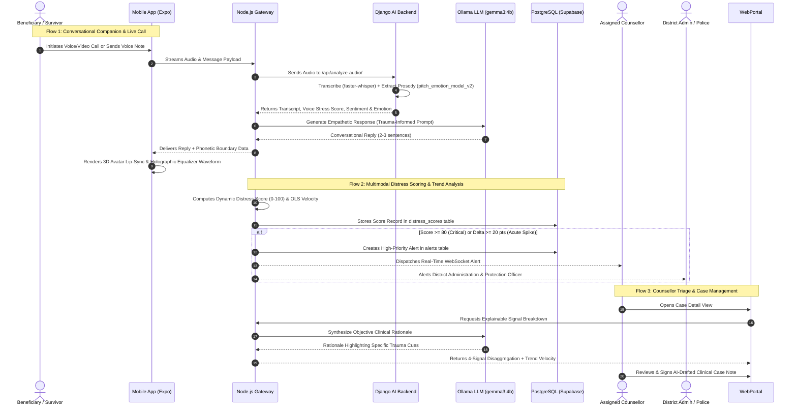
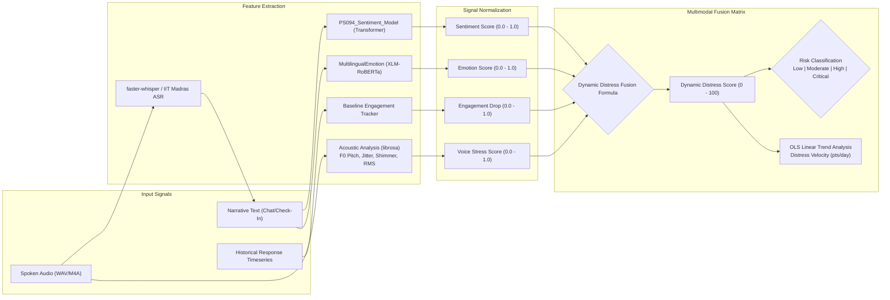
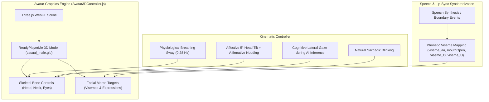
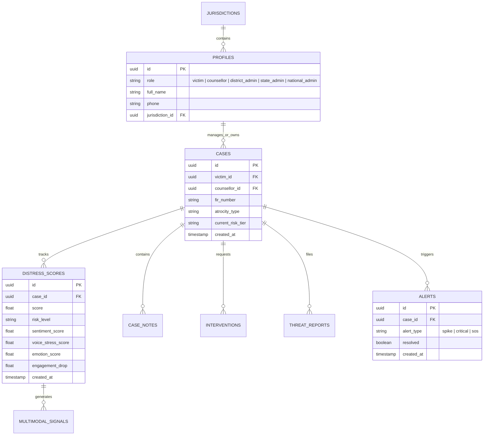

# Mansakha (मानसखा) — SIH26094
### *Mind Matters — We Are Listening*

> **AI-Powered Dynamic Mental Health Monitoring, Predictive Distress Forecasting & Rehabilitation Support Platform**  
> *Developed for the Ministry of Social Justice and Empowerment (MoSJE), Government of India*  
> *In Compliance with the Scheduled Castes and the Scheduled Tribes (Prevention of Atrocities) Act, 1989 (PoA Act) & DPDP Act 2023*

---

## 1. Project Overview & Vision

Victims of caste-based atrocities and marginalized communities in India often experience profound, compounding psychological trauma, institutional friction, and social isolation following an incident. Traditional post-incident support mechanisms are largely reactive, relying on manual complaints or delayed post-crisis interventions.

**Mansakha (मानसखा — "Companion of the Mind")** is designed as a sovereign, trauma-informed digital care ecosystem that proactively identifies psychological distress, predicts acute trauma escalation before it reaches crisis thresholds, and coordinates statutory support (Police Protection, District Legal Services Authority [DLSA], Medical Aid, and District Rehabilitation Officers) while safeguarding survivor dignity, anonymity, and data sovereignty.

### Core Objectives
- **Continuous, Compassionate Care**: Provide 24/7 empathetic conversational companion support via natural voice and video calls with expressive 3D avatars.
- **Multimodal Distress Prediction**: Analyze verbal, acoustic, emotional, and behavioral signals to calculate a real-time Dynamic Distress Score ($0-100$).
- **Early Crisis Trajectory Forecasting**: Track longitudinal score velocity ($\text{pts/day}$) using regression analysis to forecast crisis events days in advance.
- **Explainable Clinical Decision Support**: Provide assigned human counsellors with transparent multi-signal breakdowns, clinical rationales, and automated case summaries.
- **Statutory & Emergency Escalation**: Automatically route urgent intervention requests and safety triggers to District Protection Officers and Police Control Rooms (PCR 100 / Atrocity Helpline 14566).
- **100% Data Sovereignty**: Execute all AI inference locally (local PyTorch models, local faster-whisper STT, and on-premise Ollama LLM) without external third-party cloud API dependencies.

---

## 2. System Architecture & Topology

The platform employs a modular 4-tier architecture spanning mobile clients, web portals, a central API gateway, and dedicated local AI microservices:



### Component Roles

| Component | Technology Stack | Core Responsibilities |
| :--- | :--- | :--- |
| **Mobile App (`frontend/`)** | React Native (Expo), Three.js (WebGL), Canvas API | Victim mobile interface, 24/7 AI chat companion, WhatsApp-style fullscreen voice/video call, 3D animated ReadyPlayerMe counsellor avatar, 3D holographic orb visualizer, adaptive check-ins, reflective audio journaling, SOS dispatch. |
| **Web Portal (`web-frontend/`)** | React (Vite), Tailwind CSS / Vanilla CSS, Lucide Icons | Clinical and administrative dashboards for Counsellors, District Admins, State Admins, and National MoSJE Super Admins. Case queues, multi-signal explainable triage, predictive risk warnings, AI-drafted case notes, and jurisdiction analytics. |
| **API Gateway (`backend/`)** | Node.js, Express.js, Supabase JS Client | Central orchestrator handling JWT authentication, Role-Based Access Control (RBAC), database persistence, real-time alert routing, distress score aggregation, and statutory escalation triggers. |
| **AI Inference Backend (`AI-backend/`)** | Django REST Framework, PyTorch, faster-whisper, librosa, scikit-learn | Dedicated machine learning microservice for Indian-accented speech-to-text, acoustic vocal stress extraction, text trauma sentiment classification, and multilingual emotion scoring. |
| **Local LLM Daemon** | Ollama (`gemma3:4b`) | Local 4-billion parameter language model generating empathetic conversational therapy turns, context-aware check-in questions, clinical rationales, and objective case notes. |

---

## 3. End-to-End System & User Flows



### Flow 1: Victim / Beneficiary Journey
1. **Low-Friction Onboarding**: Users access the platform via mobile phone OTP, Google Authentication, or anonymous guest sessions without requiring stigmatizing identifiers.
2. **24/7 Companion Interaction**:
   - **Text Chat**: Empathetic, validating conversational grounding with concise trauma-informed responses.
   - **Voice Notes**: Spoken audio transcription and acoustic stress extraction.
   - **WhatsApp-Style Live Calls**: Fullscreen voice/video calls featuring a lifelike 3D ReadyPlayerMe male counsellor (`casual_male.glb`) with procedural head tilts, nodding, and real-time lip-sync, or a 3D depth-sorted holographic particle orb with a 28-bar audio frequency spectrum visualizer.
3. **Daily Adaptive Check-Ins**: Interactive assessments where follow-up questions dynamically adapt based on prior sessions to minimize questionnaire fatigue.
4. **Reflective Audio Journaling**: Private, client-side encrypted audio journaling with automated speech-to-text and response-length baseline monitoring.
5. **Longitudinal Progress Tracking**: Personal 14-day distress trajectory bar charts showing recovery patterns and wellness milestones.
6. **Statutory Intervention Requests**: Single-tap submission of specific rehabilitation requests:
   - Police Protection & Escort
   - DLSA Free Legal Representation
   - Immediate Medical & Psychiatric Care
   - Safe House / Relocation Assistance
7. **One-Touch Emergency SOS**: Dedicated emergency trigger directly connecting to Police Control Room (100) or National Atrocity Prevention Helpline (14566).

### Flow 2: Counsellor Clinical Care & Triage Flow
1. **Prioritized Case Queue**: Cases automatically sorted by risk tier (Low, Moderate, High, Critical) and 7-day distress velocity.
2. **Explainable Multi-Signal Breakdown**: Transparent inspection of the four underlying distress drivers:
   - **Sentiment Raw Score**: Trauma and negative affect in text.
   - **Voice Stress Score**: Vocal tension, pitch instability ($F_0$), and shimmer.
   - **Emotion Intensity**: Specific trauma markers (fear, grief, helplessness).
   - **Engagement Drop**: Significant deviations from historical response length.
3. **Explainable Clinical Rationale**: Automated contextual summaries identifying specific trauma keywords and grievance topics (e.g., threats by accused, social boycott).
4. **Predictive Escalation Warnings**: Forward-looking Ordinary Least Squares (OLS) regression calculating distress rate-of-change and estimated days before crossing into Critical risk.
5. **AI-Drafted Case Notes**: Factual, objective case note drafts automatically generated from session transcripts, allowing counsellors to review, edit, and sign notes in seconds.

### Flow 3: Administrative & Statutory Governance Flow
1. **District Administration**:
   - Monitors jurisdiction-wide active atrocity caseloads and unassigned victims.
   - Dispatches Protection Officers and coordinates legal aid with the District Legal Services Authority (DLSA).
   - Receives automatic high-priority alerts when any victim experiences a distress spike ($\Delta \ge 20$ points) or enters Critical risk ($\ge 80$).
2. **State Administration**:
   - Cross-district distress heatmaps and seasonal incident density tracking.
   - Inter-district resource balancing and counsellor staffing allocation.
3. **National Ministry (MoSJE)**:
   - Pan-India policy analytics, scheme disbursement oversight, and compliance monitoring under the PoA Act.
   - System-wide audit logs ensuring complete transparency and institutional accountability.

---

## 4. Multimodal AI & Distress Scoring Pipeline

The core intelligence engine combines natural language processing, acoustic signal processing, and longitudinal behavioral tracking into a unified mathematical evaluation:



### Mathematical Formulations

#### 1. Multimodal Input Fusion (Voice + Text)
When audio recordings are available, acoustic prosody is fused with linguistic signals:

$$\text{Distress Score} = \left( 0.40 \cdot \text{Sentiment}_{\text{raw}} + 0.30 \cdot \text{VoiceStress} + 0.20 \cdot \text{Emotion} + 0.10 \cdot \text{EngagementDrop} \right) \times 100$$

#### 2. Text-Only Input Fusion (No Voice Attached)
When communication is text-based only:

$$\text{Distress Score} = \left( 0.50 \cdot \text{Sentiment}_{\text{raw}} + 0.35 \cdot \text{Emotion} + 0.15 \cdot \text{EngagementDrop} \right) \times 100$$

#### 3. Predictive Escalation Trajectory (OLS Regression)
To project future psychological deterioration, the platform computes the slope of historical distress readings over time:

$$\text{Velocity } (m) = \frac{N \sum_{i=1}^N (t_i S_i) - \sum_{i=1}^N t_i \sum_{i=1}^N S_i}{N \sum_{i=1}^N t_i^2 - \left(\sum_{i=1}^N t_i\right)^2}$$

$$\text{Estimated Days to Critical Threshold} = \frac{80 - S_{\text{latest}}}{m} \quad (\text{when } m > 0)$$

### Clinical Risk Thresholds & System Actions

| Distress Score | Risk Tier | Clinical Interpretation | System Action & Protocol |
| :---: | :---: | :--- | :--- |
| **$0 - 29$** | **Low** | Normal psychological baseline, positive coping mechanisms. | Standard dashboard view, self-guided wellness tips, bi-weekly check-in prompt. |
| **$30 - 59$** | **Moderate** | Mild anxiety, situational stress, early trauma symptoms. | Nudge periodic check-ins, recommend calming exercises, flag for routine counsellor review. |
| **$60 - 79$** | **High** | Acute trauma markers, severe distress, social withdrawal. | High-priority counsellor notification, mandatory session scheduling within 48 hours, 14566 helpline displayed. |
| **$80 - 100$** | **Critical (SOS)** | Crisis state, severe helplessness, potential self-harm or threat. | Real-time emergency alert to Counsellor and District Admin, emergency SOS modal, automated dispatch to Protection Officer. |

---

## 5. 3D Computer Graphics & Interactive Avatar Pipeline

The frontend incorporates real-time hardware-accelerated 3D graphics to provide a humanized, comforting presence:



### Graphics Features
- **3D ReadyPlayerMe Counsellor**: Professional male counsellor model (`casual_male.glb`) with trimmed beard, short hair, and blue collared polo shirt matching administrative iconography.
- **Natural Bone Kinematics**: Procedural micro-movements simulating physiological breathing ($0.28\text{ Hz}$), random natural blinking intervals, and eye gaze alignment.
- **Affective Emotional States**:
  - **Empathy Mode**: Triggers a gentle $5^\circ$ lateral head tilt ($Z = +0.055\text{ rad}$) with slow affirmative nodding ($0.4\text{ Hz}$) when trauma or pain keywords are detected.
  - **Thinking Mode**: Slight upward cognitive tilt and sideways gaze during AI reasoning cycles.
  - **Reassuring Mode**: Direct forward gaze with supportive facial smile morphs.
- **Boundary-Driven Lip-Sync**: Phonetic mouth shapes dynamically synchronized with speech synthesis syllable boundaries.
- **Holographic 3D Audio Visualizer**: 1:1 circular particle gyroscope with 160 depth-sorted points, multi-axis orbiting planetary rings, and a 28-band real-time audio frequency equalizer for Voice Call mode.

---

## 6. Role-Based Access Control (RBAC) & Governance Hierarchy

The platform implements strict multi-tenant jurisdictional isolation:

```
National Super Admin (Ministry of Social Justice and Empowerment)
 └── State Administrator (State Social Welfare Department)
      └── District Administrator (District Magistrate / Social Welfare Officer)
           ├── Assigned Counsellor (Clinical Psychologist / Social Worker)
           ├── Protection Officer / Police First Responder (Law Enforcement)
           └── Beneficiary / Survivor (Victim of Atrocity)
```

| User Role | Access Scope | Key Permissions |
| :--- | :--- | :--- |
| **Beneficiary / Victim** | Personal Data Only | 24/7 AI chat/calls, personal check-ins, private journal, distress history, statutory intervention requests, emergency SOS. |
| **Counsellor** | Assigned Cases Only | Case review, multi-signal explainable triage, predictive risk alerts, clinical rationale view, case notes authoring/signing. |
| **District Admin** | District Jurisdiction | District caseload monitoring, case assignment to counsellors, statutory intervention routing (DLSA/Protection Officers), alert escalations. |
| **State Admin** | State Jurisdiction | Cross-district heatmaps, aggregate distress trends, resource allocation, district performance auditing. |
| **National Admin** | Pan-India | National policy analytics, MoSJE scheme monitoring, systemic compliance reporting under PoA Act, global audit logs. |

---

## 7. Data Models & Entity Relationships

The relational data tier is managed via PostgreSQL (Supabase) across 19 interconnected tables:



---

## 8. Setup & Execution Plan

The platform is engineered to run locally with zero paid cloud subscriptions:

### Prerequisites
- **Node.js** (v18.0 or higher) & **npm**
- **Python** (v3.10 or higher) with `pip`
- **Ollama** installed locally ([ollama.com](https://ollama.com))
- **Git**

### Execution Plan (Running the 5 Services)

#### 1. Start Local Ollama LLM
Open a terminal and start the local model daemon:
```bash
# Pull and start the quantized Gemma 3 4B model
ollama run gemma3:4b
```
*Runs on `http://127.0.0.1:11434`.*

#### 2. Start Django AI Inference Backend
Open a second terminal:
```bash
cd Mansakha/AI-backend

# Create and activate Python virtual environment
python -m venv venv
venv\Scripts\activate      # Windows (or: source venv/bin/activate on Unix)

# Install machine learning dependencies
pip install -r requirements.txt

# Run migrations and start server
python manage.py migrate
python manage.py runserver 8000
```
*Runs on `http://127.0.0.1:8000`. Health check: `http://127.0.0.1:8000/api/health/`.*

#### 3. Start Node.js API Gateway Backend
Open a third terminal:
```bash
cd Mansakha/backend

# Install dependencies
npm install

# Configure environment
cp .env.example .env

# Start development server
npm run dev
```
*Runs on `http://localhost:4000`. Health check: `http://localhost:4000/health`.*

#### 4. Start Web Administration & Counsellor Portal
Open a fourth terminal:
```bash
cd Mansakha/web-frontend

# Install dependencies
npm install

# Configure environment
cp .env.example .env

# Start Vite dev server
npm run dev
```
*Accessible at `http://localhost:3000`.*

#### 5. Start Mobile App (Victim Application)
Open a fifth terminal:
```bash
cd Mansakha/frontend

# Install dependencies
npm install

# Configure environment
cp .env.example .env

# Start Expo dev server
npm start
```
*Runs Expo Metro bundler on `http://localhost:8081`. Press `w` for Web or run on Android/iOS via Expo Go.*

---

## 9. Privacy, Security & Ethical Boundaries

1. **Digital Personal Data Protection (DPDP) Act 2023 Compliance**: All audio transcripts, voice notes, and clinical evaluations are processed within Indian territorial jurisdiction with 100% sovereign on-device and local edge models.
2. **Clinical Safeguards**: Mansakha functions strictly as an empathetic supportive companion and triage assistant; it does not issue psychiatric diagnoses or prescribe pharmaceutical treatments.
3. **Trauma-Informed Non-Interrogative Interaction**: The AI model is strictly prohibited from cross-examining survivors, demanding evidence, or questioning incident timelines.
4. **Emergency Priority**: SOS signals and emergency calls to PCR 100 bypass queuing mechanisms and immediately dispatch real-time alerts to designated Protection Officers.

---

## 10. Repository Organization

```
Mansakha/
├── AI-backend/               # Django REST microservice (Whisper ASR, PyTorch models)
│   ├── api/                  # Speech, prosody, and NLP inference controllers
│   ├── manage.py             # Django management entry point
│   ├── requirements.txt      # Python AI/ML dependencies
│   └── .env.example          # AI service configuration template
├── Mansakha-Ai/              # Pretrained model weights, scalers, and tokenizers
│   ├── PS094_Sentiment_Model/ # Fine-tuned trauma sentiment transformer
│   ├── MultilingualEmotion/   # XLM-RoBERTa 11-class emotion transformer
│   ├── pitch_emotion_model_v2.pkl # Acoustic voice stress ensemble classifier
│   └── scaler.pkl            # Acoustic feature normalization scaler
├── backend/                  # Node.js / Express.js central API gateway
│   ├── src/
│   │   ├── ai/               # Distress scoring formulas and OLS trajectory engine
│   │   ├── core/             # Database clients, migrations, schema.sql
│   │   ├── middleware/       # JWT auth and RBAC enforcement
│   │   ├── modules/          # User, Counsellor, and Admin route handlers
│   │   └── server.js         # Express server entry point
│   └── package.json          # Node.js dependencies
├── frontend/                 # React Native (Expo) mobile application
│   ├── src/
│   │   ├── user/chat/        # AI companion, 3D avatar controller, call modal
│   │   ├── user/wellness/    # Adaptive check-ins, journaling, SOS triggers
│   │   ├── navigation/       # Screen routers and role-aware navigation
│   │   └── services/         # API clients and offline state caches
│   ├── public/models/        # ReadyPlayerMe 3D GLB models (casual_male.glb)
│   └── package.json          # Mobile client dependencies
├── web-frontend/             # React (Vite) administrative & clinical portal
│   ├── src/
│   │   ├── counsellor/       # Case queue, explainable triage, notes authoring
│   │   ├── district_admin/   # District monitoring, assignment, alert feeds
│   │   ├── state_admin/      # Statewide heatmaps and trend analysis
│   │   └── national_admin/   # MoSJE pan-India analytics and compliance
│   └── package.json          # Web portal dependencies
├── AI_FEATURE_MAPPING_AND_ARCHITECTURE.md # Technical reference & feature map
└── README.md                 # System specification and plan (this document)
```
