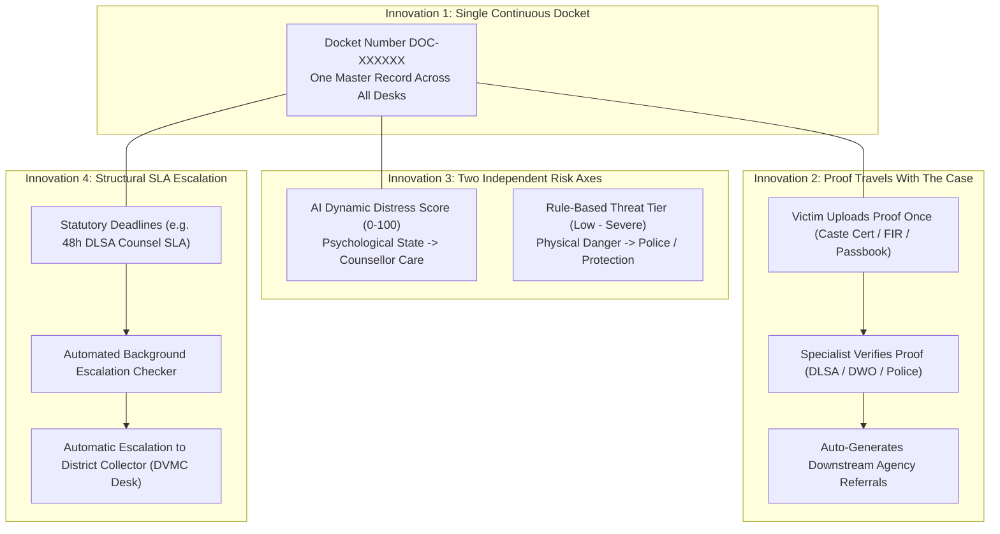
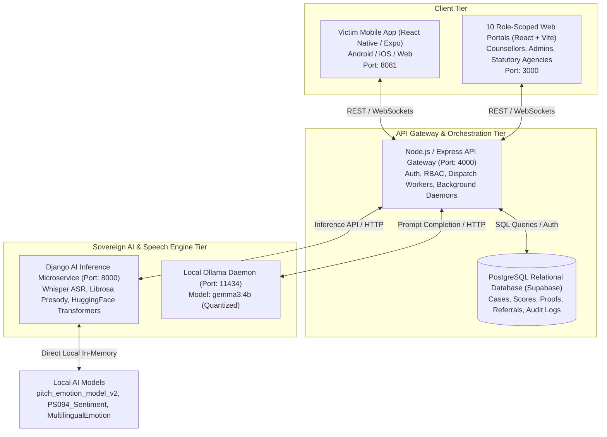
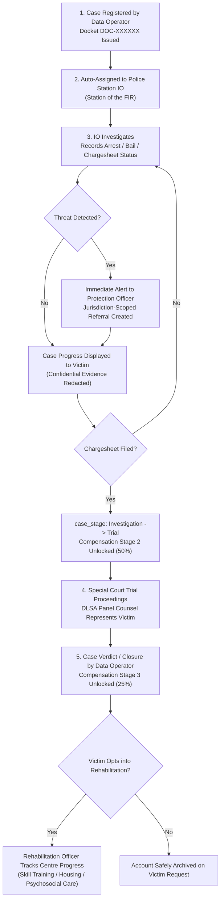
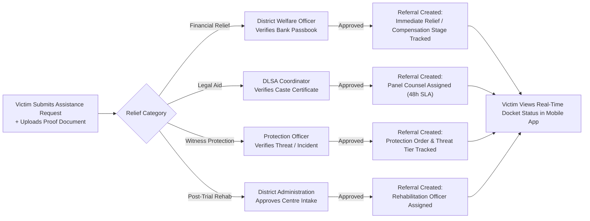
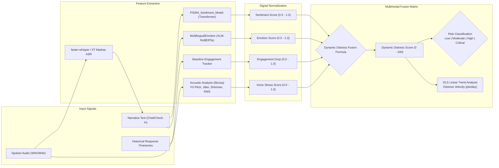
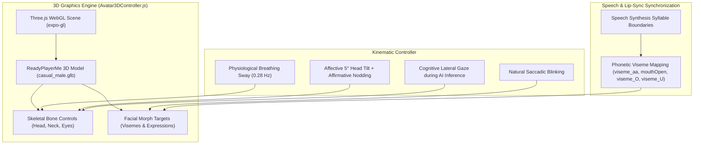
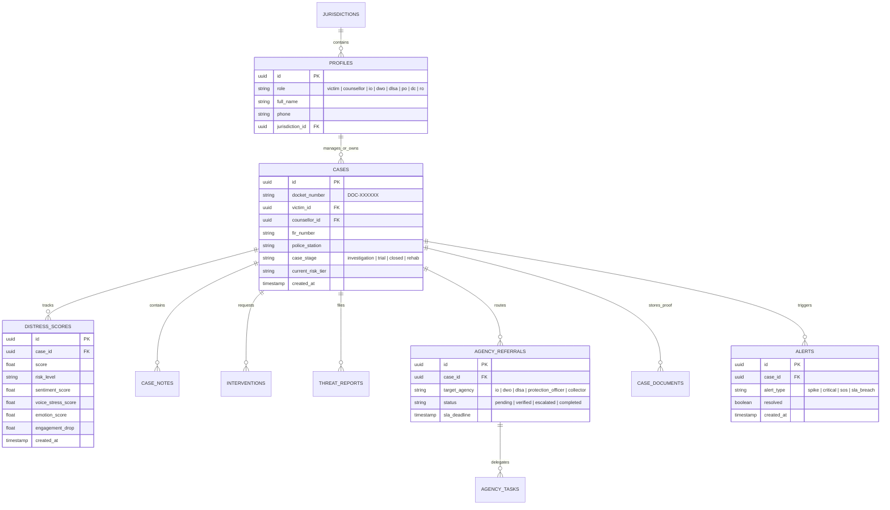

# Mansakha (मानसखा) — SIH26094
### *Mind Matters — We Are Listening*

> **Dual-Interface Digital Ecosystem for SC/ST (Prevention of Atrocities) Act Victim Support & Multi-Agency Case Coordination**  
> *Developed for the Ministry of Social Justice and Empowerment (MoSJE), Government of India*  
> *Grounded in the SC/ST (PoA) Act 1989, Dr. Ambedkar National Relief Scheme, NALSA Legal-Aid Entitlements & DPDP Act 2023*

---

## 1. Problem Statement Mapping & Vision (PS 094)

Under the **Scheduled Castes and the Scheduled Tribes (Prevention of Atrocities) Act, 1989 (PoA Act)**, a victim of a caste-based atrocity does not deal with a single government agency. Instead, their case passes through a fragmented web of separate institutional desks:
1. **The Police Station**: Registers the FIR and conducts the investigation.
2. **The District Welfare Officer (DWO)**: Verifies documents and sanctions statutory financial relief.
3. **The District Legal Services Authority (DLSA)**: Assigns free legal representation under NALSA entitlements.
4. **The Protection Officer & Local Police**: Monitors witness intimidation and assesses physical threats.
5. **The District Collector’s Vigilance & Monitoring Committee (DVMC)**: Mandated by law to review case pendency and welfare delivery.
6. **Rehabilitation Centres & District Mental Health Programme (DMHP)**: Coordinates post-closure psychosocial and vocational rehabilitation.

### The Systemic Breakdown Addressed by PS 094
- **Repeated Trauma Re-Narration**: Each department maintains its own physical paper trail. A survivor is forced to re-tell their traumatic experience at every desk they visit.
- **Disconnected Mental Health Support**: Psychological care, if available at all, is completely divorced from legal and administrative proceedings.
- **Opaque Financial Relief**: Victims have no visibility into whether their statutory compensation under the Dr. Ambedkar Scheme is being processed or delayed.
- **Unactioned Physical Threats**: Threats and intimidation raised at one office often never reach the Protection Officer or Police Station empowered to act.
- **Passive Committee Oversight**: Statutory oversight committees rely on retrospective paper registers rather than real-time tracking of missed legal deadlines.

### The Mansakha Solution
**Mansakha (मानसखा — "Companion of the Mind")** solves PS 094 through a unified dual-interface architecture: **one continuous, private mobile app for the victim** and **ten role-scoped web portals for government officials**, connected by a shared coordination and sovereign AI engine. A single continuous master docket record (`DOC-XXXXXX`) follows the survivor across all desks—eliminating repetitive narration, automating statutory deadlines, keeping mental wellness continuously monitored, and ensuring transparent financial relief.

---

## 2. Core Architectural Innovations (PS 094)

The platform is designed around four foundational innovations that address the core bottlenecks of atrocity victim rehabilitation:



### 1. Single Continuous Case Docket (`DOC-XXXXXX`)
Instead of each department maintaining a separate paper file, every registered atrocity case receives a permanent master docket identifier. Every official portal reads from and writes to its own jurisdictional section of this single docket record.

### 2. Proof Travels with the Case (Single Verification Pipeline)
Victims upload their caste certificate, FIR copy, and bank passbook **once** through the mobile app. The specific statutory authority legally mandated to verify that proof (e.g., DLSA for caste entitlements, DWO for bank details, Police for FIR) inspects it once. Approving the proof automatically creates the downstream operational referral, eliminating repetitive photocopying and bureaucratic delays.

### 3. Two Axes of Risk, Kept Strictly Independent
To prevent catastrophic misclassification, the system maintains two separate, non-conflated risk evaluations:
- **Axis A: AI-Derived Distress Score ($0-100$)**: Measures internal psychological trauma, depression, and anxiety via multimodal sentiment, voice stress, emotion, and engagement drops. Directly drives the **Counsellor** response queue.
- **Axis B: Rule-Based Threat Tier (Low / Moderate / High / Severe)**: Measures external physical danger, witness intimidation, and accused bail status. Directly drives the **Protection Officer** and **Police** operational queue.

### 4. Structural Escalation to the District Collector (DVMC Chair)
Statutory deadlines are enforced structurally rather than relying on manual reminders. Background workers monitor every active task (e.g., the **48-hour SLA** on DLSA legal-aid counsel assignment, chargesheet filing deadlines, and staged compensation milestones). If an SLA lapses, the task automatically elevates itself onto the **District Collector's** desk as the head of the District Vigilance & Monitoring Committee.

### 5. Transparent 3-Stage Statutory Compensation Tracker
Grounded directly in the **Dr. Ambedkar National Relief Scheme** and the PoA Act compensation rules, the victim app provides a real-time 3-stage visual payment tracker tied to verifiable case milestones:
- **Stage 1 (Immediate Relief / 25%)**: Disbursed upon FIR registration and initial welfare verification.
- **Stage 2 (Investigation Complete / 50%)**: Disbursed when the Investigating Officer files the chargesheet in court.
- **Stage 3 (Trial Conclusion / 25%)**: Disbursed upon trial verdict or final court judgment.

### 6. One-Tap Emergency SOS Fan-Out
When a survivor activates the emergency SOS trigger, the system simultaneously:
1. Opens the native device dialler to the **Police Control Room (PCR 100)** or the **National Atrocity Prevention Helpline (14566)**.
2. Captures GPS coordinates (best-effort, with explicit consent).
3. Dispatches high-priority emergency alerts in parallel to the **Assigned Counsellor**, **District Administration**, **State Administration**, and **Protection Officer**.

---

## 3. System Architecture & Topology

The platform deploys a 4-tier sovereign architecture ensuring 100% on-premises execution without external third-party cloud API dependencies:



---

## 4. End-to-End Case Lifecycle & Operational Flows

### A. Case Lifecycle: Registration to Closure



### B. Proof Routing & Assistance Pipeline



---

## 5. Directory of the 10 Specialized Government Roles

Each portal in the web application maps directly to a real statutory office or legal mandate under the SC/ST (PoA) Act:

| Role Title | Jurisdiction Scope | Statutory Mandate under the Act | Core Responsibilities in Mansakha |
| :--- | :--- | :--- | :--- |
| **Ministry (MoSJE)** | National | National nodal authority under the PoA Act. | Provisions official accounts, configures nationwide relief schedules, audits systemic compliance, inspects global immutable audit logs. |
| **State Administration** | State | State Social Welfare & Home Department oversight. | Monitors cross-district atrocity heatmaps, identifies emerging hotspots, manages state-level resource allocation and budget disbursals. |
| **District Administration** | District | District Magistrate / Social Welfare machinery. | District-wide oversight across all agency queues, manual cross-agency referrals, and rehabilitation program approvals. |
| **Data Operator** | Desk / Helpline | Front-desk case intake & helpline registration staff. | Registers initial cases, issues victim docket numbers (`DOC-XXXXXX`), and holds exclusive auditable authority to transition cases to `Closed`. |
| **Assigned Counsellor** | Clinical | Mental health professional (DMHP / clinical psychologist). | 24/7 empathetic chat companion monitoring, reviews explainable multi-signal breakdowns, authors and signs AI-drafted case notes. |
| **Investigating Officer (IO)** | Police Station | Police officer (DSP rank under PoA Act) at FIR station. | Records investigation milestones (arrest, bail, chargesheet filing), alerts Protection Officer on detected threats, advances case to `Trial`. |
| **District Welfare Officer (DWO)** | District | District Social Welfare Department disbursing authority. | Approves fast Immediate Relief and verifies + disburses 3-stage statutory compensation directly to victim bank accounts. |
| **DLSA Coordinator** | District | District Legal Services Authority (NALSA statutory mandate). | Enforces free legal aid entitlement gated on caste proof; assigns panel advocates under a mandatory **48-hour SLA**; tracks trial progress. |
| **Protection Officer** | District / Division | Witness and victim protection officer under PoA Act Rules. | Evaluates physical threat tiers, manages safe-house relocations, receives IO threat alerts, and coordinates immediate emergency SOS responses. |
| **District Collector** | District | Chair of the District Vigilance & Monitoring Committee (DVMC). | Automatically receives all escalated tasks—missed 48h legal SLAs, stale referrals, unpaid compensation stages—and issues binding directives. |
| **Rehabilitation Officer** | Centre-Specific | Staff at Government (DMHP) or NGO rehabilitation centres. | Manages post-closure survivor recovery, psychological counseling sessions, vocational training, and housing rehabilitation programs. |

---

## 6. Multimodal AI & Predictive Distress Pipeline

The AI engine combines natural language processing, acoustic prosody analysis, and longitudinal behavioral tracking into a unified distress evaluation:



### Mathematical Formulations

#### 1. Multimodal Input Fusion (Voice + Text Provided)
When voice audio is recorded, acoustic vocal stress is fused with linguistic and behavioral signals:

$$\text{Distress Score} = \left( 0.40 \cdot \text{Sentiment}_{\text{raw}} + 0.30 \cdot \text{VoiceStress} + 0.20 \cdot \text{Emotion} + 0.10 \cdot \text{EngagementDrop} \right) \times 100$$

#### 2. Text-Only Input Fusion (No Voice Attached)
When communication is text-based only:

$$\text{Distress Score} = \left( 0.50 \cdot \text{Sentiment}_{\text{raw}} + 0.35 \cdot \text{Emotion} + 0.15 \cdot \text{EngagementDrop} \right) \times 100$$

#### 3. Predictive Escalation Trajectory (OLS Linear Regression)
To forecast psychological deterioration before crisis occurs, the platform computes the rate of score change:

$$\text{Velocity } (m) = \frac{N \sum_{i=1}^N (t_i S_i) - \sum_{i=1}^N t_i \sum_{i=1}^N S_i}{N \sum_{i=1}^N t_i^2 - \left(\sum_{i=1}^N t_i\right)^2}$$

$$\text{Estimated Days to Critical Threshold} = \frac{80 - S_{\text{latest}}}{m} \quad (\text{when } m > 0)$$

### Clinical Risk Thresholds & Statutory Response Matrix

| Distress Score | Risk Tier | Clinical Interpretation | System Protocol & Action |
| :---: | :---: | :--- | :--- |
| **$0 - 29$** | **Low** | Stable emotional baseline, normal coping. | Standard dashboard, self-guided wellness exercises, bi-weekly check-in prompt. |
| **$30 - 59$** | **Moderate** | Mild situational anxiety, early trauma markers. | Periodic check-in nudges, grounding exercises, flagged for routine counsellor review. |
| **$60 - 79$** | **High** | Acute trauma markers, severe distress, withdrawal. | High-priority counsellor alert, mandatory session within 48h, 14566 helpline displayed. |
| **$80 - 100$** | **Critical (SOS)** | Crisis state, severe helplessness, self-harm risk. | Real-time emergency alert to Counsellor & District Admin; emergency SOS modal activated; Protection Officer notified. |

---

## 7. 3D Computer Graphics & Interactive Avatar Pipeline

The mobile client integrates real-time hardware-accelerated 3D graphics to create a humanized, reassuring companion:



### Visual & Interactive Features
- **ReadyPlayerMe 3D Model (`casual_male.glb`)**: Professional male counsellor model with trimmed beard, short hair, and blue collared polo shirt matching administrative iconography.
- **Natural Bone Kinematics**: Procedural micro-movements simulating physiological breathing ($0.28\text{ Hz}$), random natural blinking intervals, and eye saccades.
- **Affective Emotional States**:
  - **Empathy Mode**: Triggers a gentle $5^\circ$ lateral head tilt ($Z = +0.055\text{ rad}$) with slow affirmative nodding ($0.4\text{ Hz}$) upon detection of pain or trauma keywords.
  - **Thinking Mode**: Slight upward tilt and lateral cognitive gaze during AI reasoning turns.
  - **Reassuring Mode**: Direct forward gaze with supportive facial smile morphs.
- **Boundary-Driven Lip-Sync**: Phonetic mouth shapes dynamically synchronized with speech synthesis syllable boundaries.
- **1:1 Holographic Particle Gyroscope (`MansakhaCallModal.js`)**: In voice call mode, renders a distortion-free 3D particle hologram with 160 depth-sorted points, 3 rotating planetary rings, ambient radial aura, and an animated 28-bar audio frequency equalizer.

---

## 8. Relational Data Model & Schema Architecture

The relational schema is managed via PostgreSQL (Supabase) across 19 core tables:



---

## 9. Privacy, Security & Low-Bandwidth Feasibility

1. **Digital Personal Data Protection (DPDP) Act 2023 Compliance**: All audio transcripts, voice notes, and clinical evaluations are processed within Indian territorial jurisdiction with 100% sovereign on-device and local edge models.
2. **PII Separation**: Personally Identifiable Information (names, phone numbers, addresses) is stored in isolated tables separate from the AI scoring and alert pipelines.
3. **Time-Limited Signed URLs**: Uploaded proof documents (caste certificates, FIR copies, bank passbooks) are stored in secure buckets accessible only via short-lived, signed URLs.
4. **Clinical Boundaries**: Mansakha functions strictly as an empathetic supportive companion and triage assistant; it does not issue psychiatric diagnoses or prescribe medication.
5. **Trauma-Informed Non-Interrogative Interaction**: The AI model is strictly prohibited from cross-examining survivors, demanding evidence, or questioning incident timelines.
6. **Rural & Low-Bandwidth Resilience**: Mobile-first architecture with lightweight data payloads, local caching, and SMS-based check-in fallbacks for low-connectivity rural areas.

---

## 10. Setup & Execution Plan

The platform is engineered to run locally with zero paid cloud subscriptions:

### Prerequisites
- **Node.js** (v18.0 or higher) & **npm**
- **Python** (v3.10 or higher) with `pip`
- **Ollama** installed locally ([ollama.com](https://ollama.com))
- **Git**

### Execution Plan (Running the 5 Services)

#### 1. Start Local Ollama LLM
Open a terminal and start the local model daemon:
```bash
# Pull and start the quantized Gemma 3 4B model
ollama run gemma3:4b
```
*Runs on `http://127.0.0.1:11434`.*

#### 2. Start Django AI Inference Backend
Open a second terminal:
```bash
cd Mansakha/AI-backend

# Create and activate Python virtual environment
python -m venv venv
venv\Scripts\activate      # Windows (or: source venv/bin/activate on Unix)

# Install machine learning dependencies
pip install -r requirements.txt

# Run migrations and start server
python manage.py migrate
python manage.py runserver 8000
```
*Runs on `http://127.0.0.1:8000`. Health check: `http://127.0.0.1:8000/api/health/`.*

#### 3. Start Node.js API Gateway Backend
Open a third terminal:
```bash
cd Mansakha/backend

# Install dependencies
npm install

# Configure environment
cp .env.example .env

# Start development server
npm run dev
```
*Runs on `http://localhost:4000`. Health check: `http://localhost:4000/health`.*

#### 4. Start Web Administration & Multi-Agency Portal
Open a fourth terminal:
```bash
cd Mansakha/web-frontend

# Install dependencies
npm install

# Configure environment
cp .env.example .env

# Start Vite dev server
npm run dev
```
*Accessible at `http://localhost:3000`.*

#### 5. Start Mobile App (Victim Application)
Open a fifth terminal:
```bash
cd Mansakha/frontend

# Install dependencies
npm install

# Configure environment
cp .env.example .env

# Start Expo dev server
npm start
```
*Runs Expo Metro bundler on `http://localhost:8081`. Press `w` for Web or run on Android/iOS via Expo Go.*

---

## 11. Repository Organization

```
Mansakha/
├── AI-backend/               # Django REST microservice (Whisper ASR, PyTorch models)
│   ├── api/                  # Speech, prosody, and NLP inference controllers
│   ├── manage.py             # Django management entry point
│   ├── requirements.txt      # Python AI/ML dependencies
│   └── .env.example          # AI service configuration template
├── Mansakha-Ai/              # Pretrained model weights, scalers, and tokenizers
│   ├── PS094_Sentiment_Model/ # Fine-tuned trauma sentiment transformer
│   ├── MultilingualEmotion/   # XLM-RoBERTa 11-class emotion transformer
│   ├── pitch_emotion_model_v2.pkl # Acoustic voice stress ensemble classifier
│   └── scaler.pkl            # Acoustic feature normalization scaler
├── backend/                  # Node.js / Express.js central API gateway
│   ├── src/
│   │   ├── ai/               # Distress scoring formulas and OLS trajectory engine
│   │   ├── core/             # Database clients, migrations, schema.sql
│   │   ├── middleware/       # JWT auth, RBAC, and internal secret guards
│   │   ├── io/               # Investigating Officer police queue
│   │   ├── dwo/              # District Welfare Officer relief & compensation
│   │   ├── dlsa/             # DLSA legal aid & 48h counsel allocation
│   │   ├── protection_officer/ # Protection Officer threat registry
│   │   ├── district_collector/ # District Collector DVMC committee review
│   │   ├── rehabilitation_officer/ # Post-closure rehabilitation plans
│   │   ├── counsellor/       # Clinical case queue and triage
│   │   └── server.js         # Express server entry point & background daemons
│   └── package.json          # Node.js dependencies
├── frontend/                 # React Native (Expo) mobile application
│   ├── src/
│   │   ├── user/chat/        # AI companion, 3D avatar controller, call modal
│   │   ├── user/wellness/    # Check-ins, journaling, compensation tracker, SOS
│   │   ├── navigation/       # Screen routers and role-aware navigation
│   │   └── services/         # API clients and offline state caches
│   ├── public/models/        # ReadyPlayerMe 3D GLB models (casual_male.glb)
│   └── package.json          # Mobile client dependencies
├── web-frontend/             # React (Vite) multi-agency portal (10 roles)
│   ├── src/
│   │   ├── counsellor/       # Clinical triage, explainable breakdown, notes
│   │   ├── district_admin/   # District monitoring and referral routing
│   │   ├── io/               # Investigating Officer station queue
│   │   ├── dwo/              # DWO compensation and relief disbursal
│   │   ├── dlsa/             # DLSA legal counsel assignment
│   │   ├── protection_officer/ # Threat tracking and safe houses
│   │   ├── district_collector/ # DVMC committee review & escalation desk
│   │   └── rehabilitation_officer/ # Psychosocial recovery tracking
│   └── package.json          # Web portal dependencies
├── CODEBASE_ANALYSIS.md      # Comprehensive source-code technical analysis
└── README.md                 # System specification and plan (this document)
```
